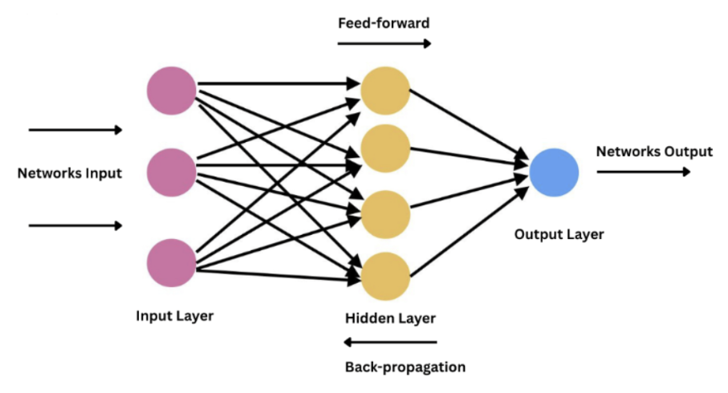

# Tugas Besar 1 IF3270 Pembelajaran Mesin Feedforward Neural Network

## 1. Deskripsi Singkat
Tugas Besar ini bertujuan untuk mengimplementasikan model Feedforward Neural Network (FFNN) from scratch menggunakan bahasa Python. FFNN merupakan salah satu dasar dari Artificial Neural Network (ANN) dalam subjek machine learning, di mana informasi yang masuk dan diproses dalam jaringan ini hanya bergerak maju dari input layer, hidden layer, dan output layer. Tugas ini akan memodelkan kelas-kelas pembentuk FFNN seperti fungsi aktivasi, fungsi loss, dan layer, serta algoritma-algoritma yang esensial dalam cara kerja FFNN berupa back propagation, dengan tujuan menentukan pengaruh dari pengaturan parameter terhadap hasil prediksi dan model FFNN.

Model FFNN diimplementasikan pada file `src/ffnn.py`, notebook `src/Pengujian.ipynb` berisi rangkaian pengujian dari model FFNN terhadap parameter tertentu yang divisualisasikan (grafik loss, perbandingan skor evaluasi, dan distribusi bobot).


## 2. Cara Setup dan Run Program
1. Pastikan Python 3.10+ sudah terpasang.
2. Buka terminal pada root project, lalu (opsional) buat virtual environment:
	
	  ```powershell
	  py -m venv .venv
	  .\.venv\Scripts\Activate.ps1
	  ```
3. Install dependency utama:
	```powershell
	pip install numpy pandas matplotlib seaborn scikit-learn jupyter notebook
	```
4. Jalankan Jupyter Notebook dari root project:
	```powershell
	jupyter notebook
	```
5. Buka file `src/Pengujian.ipynb`, lalu jalankan sel secara berurutan dari atas ke bawah (Run All) untuk melakukan pengujian model FFNN dan menghasilkan seluruh visualisasi.
6. Uji coba atau pengaturan parameter model dapat dilakukan pada `src/Pengujian.ipynb`.
7. Model dapat di save dan load menggunakan fungsi save(filename) dan load(filename) dari model FFNN.

Catatan:
- File dataset yang digunakan berada di `src/datasetml_2026.csv`.
- Implementasi inti model berada di `src/ffnn.py` dan di-import di notebook pengujian.

## 3. Pembagian Tugas
<table>
	<tr>
		<th>Nama</th>
		<th>NIM</th>
		<th>Pembagian Tugas</th>
	</tr>
	<tr>
		<td>Nicholas Andhika Lucas</td>
		<td>13523014</td>
		<td>
			1. Membuat tahapan EDA dan Preprocessing<br>
			2. Membantu pembuatan model FFNN pada definisi loss functions dan seed<br>
			3. Melakukan pengujian dan visualisasi pengujian<br>
			4. Menambahkan bonus 3 fungsi aktivasi lainnya<br>
			5. Menyusun laporan bagian deskripsi persoalan, deskripsi kelas, bonus, pengujian, dan kesimpulan
		</td>
	</tr>
	<tr>
		<td>Stefan Mattew Susanto</td>
		<td>13523020</td>
		<td>
        1. Membuat kelas Activation dan Layer<br>
        2. Membuat model kelas FFNN<br>
        3. Membuat forward propagation <br>
        4. Menyusun laporan bagian deskripsi kelas, forward propagation
        </td>
	</tr>
	<tr>
		<td>Kenneth Ricardo Chandra</td>
		<td>13523022</td>
		<td>
        1. Membuat backward propagation<br>
        2. Membuat bonus He dan Xavier initialization<br>
        3. Membuat RMS normalization<br>
        4. Menyusun laporan bagian backward propagation, weight update dan bonus<br>
        </td>
	</tr>
</table>